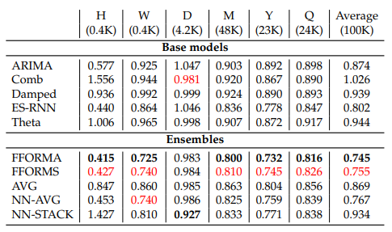

# FFORMA-ESRNN
State of the art time series forecasting method that has the FFORMA ensemble learn from the ESRNN hybrid model and others.

 

    
 

## To install:  

conda env create -f environment.yml
conda activate fformaProj